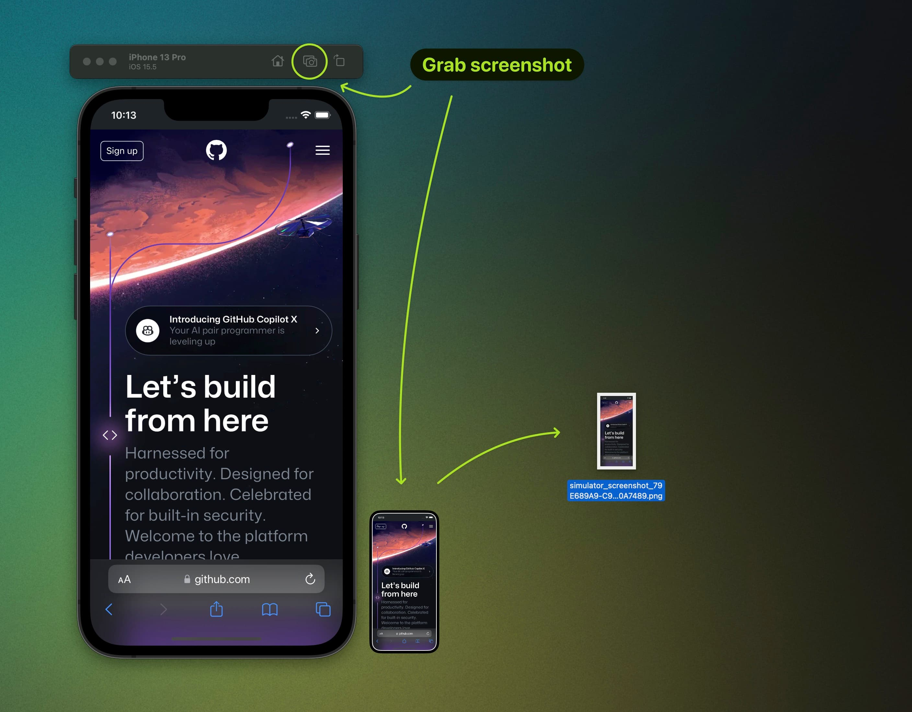
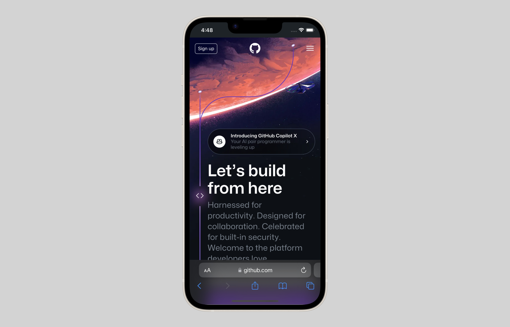

[View code](https://github.com/urre/add-device-frames)

# Add device frames to mobile screenshots

## Prerequisites

1. You need imagemagick

```shell
brew install imagemagick
```

2. Download device images for example from Apple:

```shell
curl https://devimages-cdn.apple.com/design/resources/download/Bezel-iPhone-14.dmg
```
3. Unpack the .dmg, find the file you want to use and set the name/path in the script

## Usage

### Grab screenshots

Grab a screenshot with iOS Simulator and drag/copy the image to the same folder as the script.
The script will work for as many screenshots as you have in this folder.




### Run the script

Create a transparent PNG

```shell
bash add-device-frames.sh png 0 0
```
Create a JPG with 1600/100 px x/y offset and a lightgrey background

```shell
bash add-device-frames.sh jpg 1600 100 lightgrey
```

## Options

Arguments avaliable:

- $1: file type - jpg or png
- $2: offset width - ex 60
- $3: offset height - ex 60
- $4: background color - ex white


## Demo

[View the example.html](example.html) file to se an example

```shell
open example.html
```

### Example images

JPG with an offset and a lightgrey background color.



Transparent PNG


## Notes
- The script will batch all screenshots in the current folder, adjust the filename glob in L33 to your needs and options L20-23.
- This example has been tested with an iPhone device frame at the moment, more adjustments could be needed/added for it to work on more devices.
